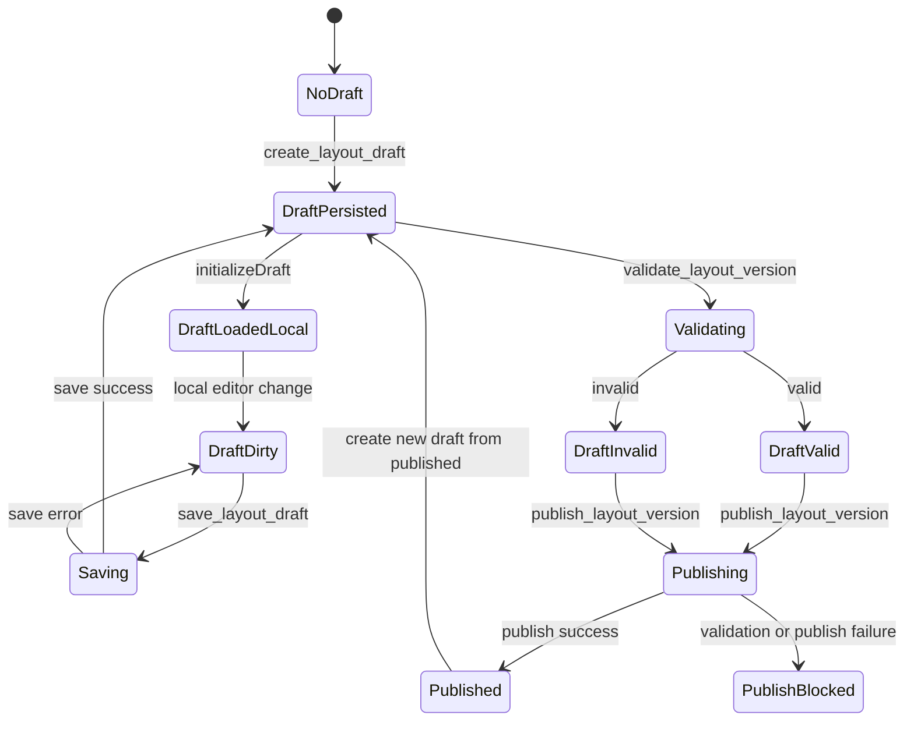

# State Map

## Purpose

This document defines the runtime state model of the current system.

It exists to answer one concrete question for agents and implementers:

`What is the source of truth for this piece of state right now?`

Without this map, it is easy to mix up:

- Supabase auth session
- BFF-resolved workspace context
- persisted layout draft in Postgres
- local unsaved editor state in Zustand
- derived UI state and validation previews

The distinction is mandatory. Similar shapes do not imply the same truth layer.

## State Layers

### 1. Auth Session State

Owner:

- Supabase Auth
- frontend bridge: `apps/web/src/app/providers/auth-provider.tsx`

What it contains:

- authenticated user session
- bearer token used by the BFF
- current authenticated `User`

Truth:

- Supabase session is the auth truth

Notes:

- the frontend does not author auth truth locally
- `AuthProvider` subscribes to Supabase auth changes and resets local app state when auth disappears
- local React state inside `AuthProvider` is only the in-memory projection of the current auth session

### 2. Workspace Context State

Owner:

- BFF `/api/me`
- backend resolution: `apps/bff/src/auth.ts`, `apps/bff/src/app.ts`
- frontend consumer: `apps/web/src/app/providers/auth-provider.tsx`

What it contains:

- user profile projection
- tenant memberships
- `currentTenantId`

Truth:

- BFF `/api/me` resolves workspace truth
- the BFF derives it from Supabase auth token plus `profiles` and `tenant_members`

Notes:

- tenant/workspace context is not taken from a frontend store
- frontend keeps a local copy in `AuthProvider`, but that copy is not authoritative
- auth reset clears Query cache, UI store, and editor store to avoid cross-workspace leakage

### 3. Global App UI State

Owner:

- Zustand `ui-store`
- file: `apps/web/src/app/store/ui-store.ts`

What it contains:

- `isDrawerCollapsed`
- `activeSiteId`
- `activeFloorId`

Truth:

- this is app-shell interaction state, not warehouse truth

Notes:

- `activeSiteId` and `activeFloorId` select context for queries and editor bootstrapping
- they do not create or persist domain entities by themselves
- changing `activeSiteId` resets `activeFloorId` locally
- site/floor records themselves remain server state fetched through TanStack Query

### 4. Server-Fetched Warehouse Context State

Owner:

- TanStack Query
- query files under `apps/web/src/entities/site/api`, `apps/web/src/entities/floor/api`, `apps/web/src/entities/layout-version/api`

What it contains:

- sites list
- floors list for active site
- active layout draft for active floor
- published layout summary for active floor

Truth:

- this is cached server state
- authority still remains in Postgres/BFF, not in the Query cache

Notes:

- Query cache is a transport-level read model
- invalidation refreshes this layer after mutations
- if Query cache is cleared, no business truth is lost

### 5. Persisted Layout Draft State

Owner:

- Postgres tables and RPC in Supabase
- tables: `layout_versions`, `racks`, `rack_faces`, `rack_sections`, `rack_levels`
- RPC: `create_layout_draft`, `save_layout_draft`

What it contains:

- the currently persisted editable draft for one floor
- the active `layout_versions.state = 'draft'` version
- full persisted rack structure for that version

Truth:

- `layout_versions` draft is persisted editing truth

Notes:

- there can be only one active draft per floor
- `create_layout_draft` clones the latest published version when needed
- `save_layout_draft` replaces the persisted draft contents from the submitted payload
- this layer is the authoritative editing snapshot once save succeeds

### 6. Local Editor Working State

Owner:

- Zustand editor store
- file: `apps/web/src/entities/layout-version/model/editor-store.ts`

What it contains:

- `draft`
- `draftSourceVersionId`
- `isDraftDirty`
- selection state
- hover state
- placement mode
- zoom
- creation-wizard linkage
- editor-specific spacing constraints

Truth:

- Zustand editor store is local unsaved working state

Notes:

- this store is initialized from the fetched persisted draft
- after initialization it can diverge from server truth immediately
- unsaved rack creation, movement, duplication, rotation, and structure changes live here first
- `isDraftDirty` means local editor state is ahead of persisted draft state

### 7. Derived UI State

Owner:

- React render logic
- selectors
- pure domain functions
- Query status flags

What it contains:

- `WarehouseSetupState` such as `bootstrap_required`, `draft_loading`, `draft_ready`
- top-bar action enablement from `getLayoutActionState`
- validation badges and issue summaries
- preview addresses generated from local draft
- inspector open/closed state
- local status messages

Truth:

- derived UI state is not persisted truth

Notes:

- validation preview is derived, not persisted
- address preview is derived from local draft through pure domain logic
- button enabled/disabled state is derived from active floor, live draft status, local draft presence, and dirty state

## Truth Hierarchy

When multiple layers disagree, use this order:

1. Supabase Auth session is truth for authentication identity.
2. BFF `/api/me` is truth for workspace membership and active tenant projection.
3. Postgres persisted draft is truth for saved editable layout state.
4. Zustand editor store is truth only for unsaved in-progress edits in the current browser session.
5. Query cache is a disposable cached projection of server responses.
6. Derived UI state is never a source of truth.

## State Categories by Concern

| Concern | Canonical owner | Local mirrors | Must not be treated as truth |
|---|---|---|---|
| Authenticated user | Supabase Auth session | `AuthProvider.user` | route state, Query cache |
| Tenant/workspace | BFF `/api/me` | `AuthProvider.currentTenantId`, `memberships` | `ui-store`, route params |
| Available sites/floors | BFF + Postgres via Query | Query cache | `activeSiteId`, `activeFloorId` alone |
| Current selected site/floor | `ui-store` | top bar select controls | site/floor query results |
| Saved editable layout | Postgres `layout_versions` draft + child tables | active draft Query cache | editor local `draft` when dirty |
| Unsaved edits | editor Zustand store | component selectors | Postgres until save succeeds |
| Published layout summary | Postgres published version + generated cells | Query cache | local editor draft |
| Validation preview | pure domain/client or cached validation query | inspector/top bar render state | persisted draft or published truth |
| Drawer/inspector open state | local React or `ui-store` | component state | any server layer |

## Critical State Boundaries

- Supabase session is auth truth.
- BFF `/api/me` resolves workspace truth.
- `layout_versions` draft is persisted editing truth.
- Zustand editor store is local unsaved working state.
- validation preview is derived, not persisted.
- Query cache is a server snapshot cache, not authority.
- published layout and active draft are different persisted truths with different roles.
- `activeSiteId` and `activeFloorId` choose context; they do not persist context entities.

## Global App State Map

```text
Supabase Auth
  -> AuthProvider
    -> user
    -> currentTenantId
    -> memberships

BFF /api/*
  -> TanStack Query cache
    -> sites
    -> floors(activeSiteId)
    -> activeDraft(activeFloorId)
    -> publishedSummary(activeFloorId)
    -> cachedValidation(layoutVersionId)

Zustand ui-store
  -> isDrawerCollapsed
  -> activeSiteId
  -> activeFloorId

Zustand editor-store
  -> local draft
  -> dirty flag
  -> selection / hover / zoom / mode

Derived render state
  -> setup state
  -> action availability
  -> validation preview
  -> address preview
  -> status labels
```

## Auth and Workspace Flow

### Auth bootstrap

1. Supabase client resolves the current session.
2. `AuthProvider` reads the authenticated user from Supabase.
3. The frontend calls BFF `/api/me` with the bearer token.
4. BFF validates the token and resolves memberships from `profiles` and `tenant_members`.
5. `AuthProvider` stores the resolved workspace projection in React state.

### Auth reset boundary

On sign-out or auth loss:

- Query cache is cleared
- UI store is reset
- editor store is reset

This is an anti-leak boundary. No workspace-scoped local state should survive auth loss.

## Active Site and Floor State

There are two different concerns here:

### Site and floor entity truth

Owned by:

- BFF + Postgres
- fetched through TanStack Query

This answers:

- which sites exist
- which floors exist for a site

### Current active site/floor selection

Owned by:

- Zustand `ui-store`

This answers:

- which site the current screen is pointed at
- which floor the editor should load

Important distinction:

- the site/floor lists are server state
- the active selection is UI context state

## Layout State Separation

This is the most important split in the application.

### A. Server truth

Meaning:

- authoritative state stored in Supabase/Postgres and exposed through BFF

Includes:

- current draft in `layout_versions` + child tables
- current published layout version
- generated published `cells`
- server-side validation result returned by validate/publish RPC when requested

Important:

- validation output is server-derived, but not persisted entity truth by itself

### B. Persisted draft

Meaning:

- the saved editable draft for a floor

Representation:

- `layout_versions.state = 'draft'`
- rows in `racks`, `rack_faces`, `rack_sections`, `rack_levels`

Key rule:

- this is the editing truth after a successful save

### C. Local editor state

Meaning:

- unsaved working copy held in browser memory

Representation:

- `useEditorStore().draft`
- `isDraftDirty`
- selection, placement, hover, zoom, creation flow

Key rule:

- local editor state may intentionally diverge from persisted draft

### D. Derived UI state

Meaning:

- values calculated from other layers for rendering or guidance

Examples:

- setup gate state
- action enabled/disabled flags
- rack validation badges
- generated address preview
- "Unsaved" or "Synced" chip

Key rule:

- never persist derived UI state as if it were domain truth

## Editor Draft Lifecycle

### Initialization

1. Query loads active draft for `activeFloorId`.
2. `WarehouseEditor` calls `initializeDraft`.
3. editor store clones the fetched draft and marks `isDraftDirty = false`.

### Local edit phase

All editor actions mutate only local editor store first:

- create rack
- delete rack
- duplicate rack
- move rack
- rotate rack
- change face configuration
- change section/level structure

These transitions set `isDraftDirty = true`.

### Save boundary

`save_layout_draft` is the only transition that moves local draft changes into persisted draft truth.

On save success:

- editor store calls `markDraftSaved`
- local dirty flag becomes `false`
- cached validation query for that layout version is removed
- active draft query is invalidated

Important:

- until save succeeds, Query cache and Postgres still reflect the older persisted draft

## Server State in TanStack Query

TanStack Query is used for server-fetched state and cached validation results.

### Query-owned state

- `sites`
- `floors(siteId)`
- `layout-version.active-draft(floorId)`
- `layout-version.published-summary(floorId)`
- `layout-validation(layoutVersionId)`

### Query semantics

- Query data is cache, not ownership
- query keys define isolation by site, floor, or layout version
- mutations invalidate or overwrite relevant cache entries
- clearing the Query client must not lose any persisted business state

### Validation cache nuance

`useLayoutValidation` stores successful validation results in Query cache by `layoutVersionId`.

That cached validation means:

- "this exact saved layout version was validated"

It does not mean:

- "the current local editor draft is still valid"

When local draft becomes dirty again, UI must treat cached validation as stale for the current working copy.

## UI Ephemeral State vs Persisted Draft State

### UI ephemeral state

Examples:

- drawer collapsed
- inspector open
- selected rack ids
- hovered rack id
- current tool mode
- current zoom
- wizard step
- temporary status message

Properties:

- browser-memory only
- disposable
- safe to reset on auth/floor switch

### Persisted draft state

Examples:

- rack geometry
- rack kind
- face enablement
- numbering direction
- sections
- levels
- draft version identity

Properties:

- stored in Postgres
- survives reload
- shared truth across sessions once saved

Rule:

- if reloading the page should preserve it, it belongs in persisted draft or server truth
- if it only helps the current interaction, it belongs in local/editor/UI state

## Mutation Lifecycle

At the TanStack level every mutation follows:

`idle -> pending -> success | error`

What changes after success depends on the mutation.

### Create draft

Canonical write:

- RPC `create_layout_draft`

On success:

- active draft query for the floor is invalidated
- next query fetch returns persisted draft truth

### Save draft

Canonical write:

- RPC `save_layout_draft`

On success:

- local draft is marked saved
- validation cache for that layout version is cleared
- active draft query is invalidated

### Validate draft

Canonical compute:

- RPC `validate_layout_version`

On success:

- validation result is written to Query cache
- no persisted draft rows are changed
- no publish state changes happen

### Publish draft

Canonical write:

- RPC `publish_layout_version`

Server-side effects:

- validate again on the server
- regenerate `cells`
- archive previous published version for the floor
- mark current layout version as `published`
- mark racks as `published`

Client-side effects:

- active draft query is invalidated
- publish result is returned to the UI

Important:

- publish is not a pure cache operation
- publish changes authoritative persisted state
- `published-summary(floorId)` is a separate Query cache entry and should be treated as stale until refetched

## Publish and Validate Flow States

### Draft working state

```text
clean draft -> local edit -> dirty draft
dirty draft -> save pending -> saved draft
save error -> still dirty draft
```

### Validation state

```text
saved draft -> validating -> valid
saved draft -> validating -> invalid
dirty local draft -> preview only
```

### Publish state

```text
saved + valid draft -> publishing -> published
saved + invalid draft -> publishing -> publish_blocked
dirty local draft -> publish disabled in UI
```

Current implementation nuance:

- the UI requires a clean saved draft before publish
- the UI does not require a cached `valid` state before enabling publish
- final publish gating happens in `publish_layout_version`, which validates again on the server

## State Machine



## Boundary Rules for Agents

- Never treat Query cache as the durable source of truth.
- Never treat editor-store `draft` as persisted truth while `isDraftDirty = true`.
- Never treat validation preview as a persisted validation artifact.
- Never infer workspace truth from `activeSiteId` or `activeFloorId`.
- Never infer auth truth from route accessibility alone.
- Published layout truth and editable draft truth are different persisted states; do not merge them conceptually.
- If a value can be recomputed from other state for rendering, classify it as derived UI state until proven otherwise.

## Practical Decision Guide

Ask these questions in order:

1. Does this value survive reload and need multi-request consistency?
   If yes, look for server truth or persisted draft truth.
2. Does this value exist only until the user clicks save?
   If yes, it belongs to local editor state.
3. Is this value only selecting context or controlling presentation?
   If yes, it is UI state.
4. Is this value computed from another state layer?
   If yes, it is derived UI state, not truth.

## Current Canon in One Sentence

Supabase owns auth truth, the BFF owns workspace projection, Postgres owns persisted draft and published layout truth, Zustand editor store owns unsaved edits, and Query/UI layers only project or derive that truth for the current screen.
